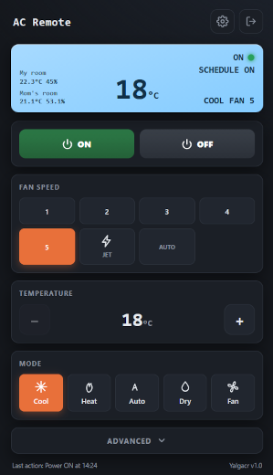

# Yet another LG AC remote (Yalgacr)

This is my first GitHub project, it was coded using Claude(Opus 4.8 Max) AI, a from-scratch software remote for an LG air conditioner, driving the unit over
infrared from a Raspberry Pi and a USB Infrared Toy v2. The IR protocol was
reverse-engineered byte by byte (no vendor library), so every button on the
original **AKB74955603** remote is reproduced in software.

Two independent front-ends share the same verified encoder:

* **`lgac-web.py`** — a self-contained Flask web app (controls, users, HTTPS,
  sensors, scheduler, audit log) in a single file.
* **`lgac-cli.py`** — a command-line tool for scripting and quick one-off commands.

> Reverse-engineered and verified against captured frames from remote
> **AKB74955603** (LG **S12EQ** indoor unit). Other LG models use different
> codes and are not guaranteed to work.

## Screenshots



## Features

**Climate & functions**

* Power on/off, mode (Cool / Dry / Fan / Auto / Heat), temperature, fan speed
* Jet (turbo), vertical swing, display light, air purify, moisture removal,
  quiet mode, and four-level energy saving

**Web app (`lgac-web.py`)**

* Clean responsive control panel with a simulated LCD that reflects the last commanded state
* User accounts with `admin` / `user` roles (password hashing via Werkzeug)
* Per-user simulated LCD backlight colour
* HTTP or HTTPS, with self-signed, Let's Encrypt, or manually supplied certs
* Optional BME280 temperature/humidity sensors (local I2C or remote `pigpiod`)
* Weekly on/off **scheduler**
* **Audit log** of every command (timestamp, user, IP, action)
* Off-state lock and a configurable IR rate-limit, both enforced server-side
* In-process restart on settings change — no manual service restart needed

**CLI (`lgac-cli.py`)**

* Every command available from the shell, with a `--dry` (preview) mode
* `--status` to print the last known state
* Local USB IR Toy **or** a remote one shared over the network

## Hardware

* Raspberry Pi (tested on a Pi 5 and a Pi Zero W) running Linux
* **USB Infrared Toy v2** (Dangerous Prototypes) with an IR LED in
  line-of-sight of the air conditioner
* _Optional:_ one or more BME280 sensors for room temperature/humidity

### IR Toy showing up as `/dev/lirc0` instead of `/dev/ttyACM0`

On recent Linux kernels the in-tree `ir_toy` driver claims the IR Toy and
exposes it as a LIRC device (`/dev/lirc0`). This project talks to the IR Toy in
its own sample-mode protocol over a serial port, so it needs `/dev/ttyACM0`
instead. Blacklisting `ir_toy` alone is not enough: `cdc-acm` carries an
`IGNORE_DEVICE` quirk for the IR Toy's VID:PID (`04d8:fd08`), so with `ir_toy`
out of the way the device is simply ignored and no `ttyACM` node appears either.

The fix is to disable `ir_toy` and binary-patch that one quirk out of `cdc-acm`,
so `cdc-acm` then binds the device by its USB class. The VID:PID sits in the
module as the little-endian bytes `d8 04 08 fd`; changing the first byte to `ff`
makes the quirk miss the real device. On newer kernels the modules are
XZ-compressed (`.ko.xz`), so they are decompressed, patched, and written back as
a plain `.ko`:

```bash
# Confirm the VID:PID first; adjust the byte pattern if your PID differs
lsusb | grep -i 04d8        # ID 04d8:fd08 Microchip Technology, Inc.

cd /lib/modules/$(uname -r)/kernel/drivers

# 1) Stop ir_toy from claiming the device
sudo mv -n media/rc/ir_toy.ko.xz media/rc/ir_toy.ko.xz.DISABLED

# 2) Patch cdc-acm; the byte pattern must appear exactly once (check prints 1)
cd usb/class
sudo mv -n cdc-acm.ko.xz cdc-acm.ko.xz.DISABLED
xz -dc cdc-acm.ko.xz.DISABLED | LC_ALL=C grep -o -a $'\xd8\x04\x08\xfd' | wc -l
xz -dc cdc-acm.ko.xz.DISABLED \
  | LC_ALL=C sed -e 's/\xd8\x04\x08\xfd/\xff\x04\x08\xfd/' \
  | sudo tee cdc-acm.ko >/dev/null

# 3) Rebuild module dependencies, then reboot to apply cleanly
sudo depmod -a
sudo reboot
```

Run this in `bash` (the `$'...'` byte literals need ANSI-C quoting). After the
reboot, `ls -l /dev/ttyACM0` should list the device. Older kernels that ship
uncompressed `.ko` modules skip the `xz` steps and `sed` `cdc-acm.ko` directly.

Two caveats: a kernel upgrade reinstalls the stock modules and silently undoes
the patch (`apt-mark hold` the kernel package if that matters to you), and
Raspberry Pi OS does not enforce module signing, so the patched, unsigned module
loads without complaint.

### Remote IR over the network (socat)

The IR transmitter does not have to sit on the same machine as the web app. A
common setup is to run the web app on a capable Pi (or any Linux box) and put a
small, cheap Pi — a Pi Zero W is plenty — with the IR Toy in the same room as
the air conditioner, then bridge the two over the LAN:

* On the **IR Pi** (the one physically holding the USB IR Toy), `socat` exposes
  the serial device as a plain TCP port:

  ```bash
  socat -d TCP-LISTEN:2000,reuseaddr,fork /dev/ttyACM0,raw,echo=0,b115200
  ```

  This is wrapped in the included **[`irtoy-socat.service`](irtoy-socat.service)**
  systemd unit so the bridge starts on boot and restarts on failure. The unit is
  security-hardened — it runs as an unprivileged `DynamicUser`, with a read-only
  filesystem and a device allow-list that exposes nothing but the IR Toy:

  ```bash
  sudo cp irtoy-socat.service /etc/systemd/system/
  sudo systemctl daemon-reload
  sudo systemctl enable --now irtoy-socat
  ```

* On the **app/CLI side**, point at that Pi instead of a local device:
  * Web app: *Settings → IR → Remote*, with the IR Pi's address and port `2000`.
  * CLI: add `--host <ir-pi-address> --port 2000` to any command.

The IR Toy enumerates as a USB CDC-ACM device (`/dev/ttyACM0`), so the bridge is
just raw bytes over TCP — both front-ends speak the IR Toy's sample-mode
protocol directly, whether the device is local or across the network.

## Requirements

* Python 3.9+
* `Flask` and `pyserial` (see [`requirements.txt`](requirements.txt))
* Optional sensor support: `RPi.bme280` + `smbus2` (local I2C) or `pigpio` (remote)

## Installation

```bash
git clone https://github.com/bojan385/yalgacr.git
cd yalgacr
python3 -m venv venv
source venv/bin/activate
pip install -r requirements.txt
```

## Usage

### Web app

```bash
python3 lgac-web.py                 # local USB IR Toy, HTTP on :8080
python3 lgac-web.py --host 0.0.0.0  # listen on all interfaces
```

Then open `http://<pi-address>:8080` and sign in. **Default credentials are
`admin` / `admin` — change them immediately** under *Settings → Users*.
Ports, HTTP/HTTPS, the IR transport (local/remote), sensors, the scheduler and
users are all configured from the **Settings** page; there is no port flag.

### CLI

```bash
lgac-cli.py --on                              # power on (restores last state)
lgac-cli.py --off                             # power off
lgac-cli.py --mode cool --temp 22 --fan 3     # set everything at once
lgac-cli.py --temp 19                         # change only temperature
lgac-cli.py --jet on                          # jet (turbo) mode
lgac-cli.py --vswing 3                         # vertical louver position
lgac-cli.py --status                          # show last known state (no send)
lgac-cli.py --temp 22 --host 192.168.0.24     # send via a remote IR Toy
lgac-cli.py --off --dry                       # preview without sending
```

## Run as a service

A sample unit file, [`lgac-web.service`](lgac-web.service), is included. Adjust
the paths/user inside it, then:

```bash
sudo cp lgac-web.service /etc/systemd/system/
sudo systemctl daemon-reload
sudo systemctl enable --now lgac-web.service
```

## Files at runtime

The app and CLI keep their data **next to the script** and these files are
intentionally **not** tracked in git (see `.gitignore`):

| File                | Purpose                                          |
| ------------------- | ------------------------------------------------ |
| `lgac-config.json`  | Settings, users (hashed), secret key, certs      |
| `lgac-state.json`   | Last commanded AC state                          |
| `lgac.log`          | Shared audit log (web app, CLI, scheduler)       |

## Security

* `lgac-config.json` contains a session secret and password hashes — never
  commit it, and do not expose the web app to the public internet without
  HTTPS and strong credentials.
* Change the default `admin` / `admin` login before first real use.

## Limitations and extending

### Horizontal swing (decoded, not wired up)

The **S12EQ** has no horizontal louvre, so horizontal swing is deliberately not
exposed in the UI or CLI — on this unit these frames simply do nothing. The
remote *does* transmit them, though, and they were captured and verified (each
position three times, bit-identical), so the complete data is given here for
anyone whose LG unit supports it.

Horizontal swing shares the same command space as vertical swing
(`N4 N3 = 1 3`, so every frame begins `8 8 1 3`). `N2` selects the category
(`0` = a fixed louvre position, `1` = a moving/swing pattern) and `N1` the
position; `N0` is the usual checksum `(8 + 8 + 1 + 3 + N2 + N1) & 0xF`:

| Function              | Frame       | N2 | N1 |
| --------------------- | ----------- | -- | -- |
| Horizontal position 1 | `0x88130BF` | 0  | B  |
| Horizontal position 2 | `0x88130C0` | 0  | C  |
| Horizontal position 3 | `0x88130D1` | 0  | D  |
| Horizontal position 4 | `0x88130E2` | 0  | E  |
| Horizontal position 5 | `0x88130F3` | 0  | F  |
| Swing, left half      | `0x8813105` | 1  | 0  |
| Swing, right half     | `0x8813116` | 1  | 1  |
| Swing, full           | `0x881316B` | 1  | 6  |
| Swing, off            | `0x881317C` | 1  | 7  |

(For reference, vertical swing uses the same `8 8 1 3` prefix with positions
1–6 at `N2=0, N1=4…9`, full at `N2=1 N1=4`, and off at `N2=1 N1=5`.)

Wiring it up is then mechanical — mirror the existing vertical-swing encoder:

```python
HSWING = {
    "1": (0x0, 0xB), "2": (0x0, 0xC), "3": (0x0, 0xD),
    "4": (0x0, 0xE), "5": (0x0, 0xF),
    "left_half": (0x1, 0x0), "right_half": (0x1, 0x1),
    "full": (0x1, 0x6), "off": (0x1, 0x7),
}

def encode_hswing(pos):
    n2, n1 = HSWING[pos]
    return make_frame(0x1, 0x3, n2, n1)   # same frame builder as vertical swing
```

then add a segment in the web UI and a `--hswing` flag in the CLI. The same
approach works for any button the S12EQ lacks but a related LG unit has: once a
frame is captured and verified, wiring it into both front-ends is straightforward.

## Credits

The LG IR protocol was not reverse-engineered entirely from scratch. The
starting point — the 28-bit frame layout and the command / mode / fan /
temperature codes — came from the **ESPHome** project, specifically its LG
climate IR component:

> [`esphome/components/climate_ir_lg/climate_ir_lg.cpp`](https://github.com/esphome/esphome/blob/dev/esphome/components/climate_ir_lg/climate_ir_lg.cpp)
> — part of [ESPHome](https://github.com/esphome/esphome).

That implementation was used as the reference for the frame structure; the
encoder here was then re-implemented in Python and verified against frames
captured from the original **AKB74955603** remote, with the extra functions
(jet, display light, air purify, moisture removal, quiet, energy saving and the
individual swing positions) decoded on top. Many thanks to the ESPHome authors
and contributors for the groundwork.

## License

This project is licensed under the **GNU General Public License v2.0** — see
the [LICENSE](LICENSE) file for the full text.

Copyright (C) 2026 &lt;Bojan&gt;
